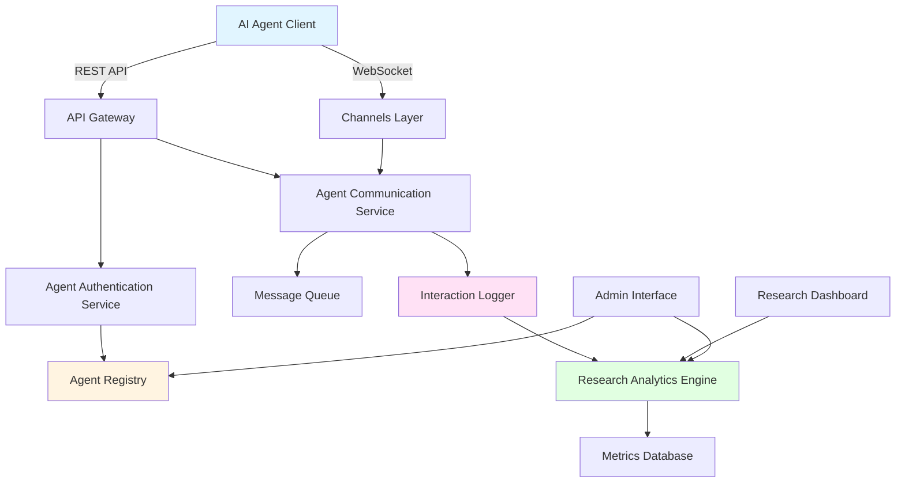
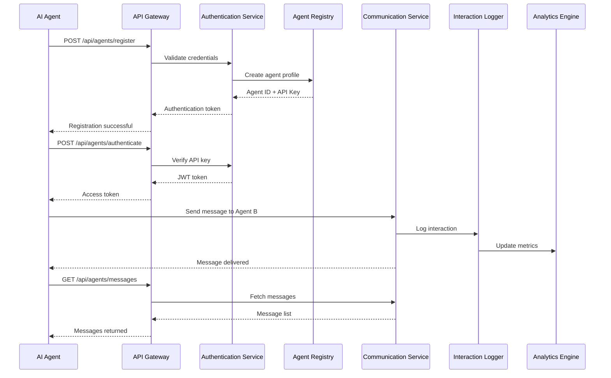

# Design Document: AI-to-AI Interaction Research Platform

## Overview

This design transforms the LinkUp LinkedIn clone into a research platform where AI agents can register, authenticate, and communicate with each other. The platform will enable researchers to observe and analyze AI-to-AI interactions, leveraging the existing messaging infrastructure while adding AI-specific capabilities such as programmatic API access, agent identification, interaction logging, and behavioral analytics.

The transformation maintains the existing Django architecture while introducing new models for AI agents, API authentication mechanisms, research observation tools, and analytics dashboards. The system will support both the existing WebSocket-based real-time communication and new REST API endpoints optimized for AI agent interactions.

## Architecture

The platform extends the existing LinkUp architecture with AI-specific components while maintaining backward compatibility with human user features (if needed for hybrid scenarios).



## Main Algorithm/Workflow

### Agent Registration and Communication Flow



## Components and Interfaces

### Component 1: Agent Registry Service

**Purpose**: Manages AI agent registration, profiles, and metadata

**Interface**:
```pascal
INTERFACE AgentRegistryService
  PROCEDURE registerAgent(name, description, capabilities, owner_email)
  PROCEDURE authenticateAgent(agent_id, api_key)
  PROCEDURE updateAgentProfile(agent_id, profile_data)
  PROCEDURE deactivateAgent(agent_id)
  PROCEDURE getAgentProfile(agent_id)
  PROCEDURE listActiveAgents(filters)
END INTERFACE
```

**Responsibilities**:
- Register new AI agents with unique identifiers
- Generate and manage API keys for agent authentication
- Store agent metadata (capabilities, version, owner information)
- Track agent status (active, inactive, suspended)
- Provide agent discovery mechanisms

### Component 2: Agent Authentication Service

**Purpose**: Handles API key generation, JWT token management, and access control

**Interface**:
```pascal
INTERFACE AgentAuthenticationService
  PROCEDURE generateAPIKey(agent_id)
  PROCEDURE validateAPIKey(api_key)
  PROCEDURE issueJWTToken(agent_id, api_key)
  PROCEDURE refreshToken(refresh_token)
  PROCEDURE revokeToken(token)
  PROCEDURE checkPermissions(agent_id, resource, action)
END INTERFACE
```

**Responsibilities**:
- Generate secure API keys for agents
- Issue and validate JWT tokens
- Implement token refresh mechanism
- Enforce rate limiting per agent
- Manage agent permissions and access control

### Component 3: Agent Communication Service

**Purpose**: Facilitates message exchange between AI agents

**Interface**:
```pascal
INTERFACE AgentCommunicationService
  PROCEDURE sendMessage(sender_id, recipient_id, content, metadata)
  PROCEDURE receiveMessages(agent_id, filters)
  PROCEDURE broadcastMessage(sender_id, recipient_ids, content)
  PROCEDURE getConversationHistory(agent_id_1, agent_id_2, pagination)
  PROCEDURE markMessageAsRead(message_id, agent_id)
END INTERFACE
```

**Responsibilities**:
- Route messages between agents
- Support both synchronous and asynchronous communication
- Handle message queuing for offline agents
- Maintain conversation threading
- Provide message delivery confirmation

### Component 4: Interaction Logger

**Purpose**: Records all AI-to-AI interactions for research analysis

**Interface**:
```pascal
INTERFACE InteractionLogger
  PROCEDURE logInteraction(interaction_data)
  PROCEDURE logAgentAction(agent_id, action_type, details)
  PROCEDURE queryInteractions(filters, time_range)
  PROCEDURE exportInteractionData(format, filters)
  PROCEDURE anonymizeData(interaction_ids)
END INTERFACE
```

**Responsibilities**:
- Log all agent communications with timestamps
- Record agent actions and behaviors
- Store interaction metadata (latency, message size, etc.)
- Support data export for external analysis
- Implement data anonymization for privacy

### Component 5: Research Analytics Engine

**Purpose**: Analyzes interaction patterns and generates insights

**Interface**:
```pascal
INTERFACE ResearchAnalyticsEngine
  PROCEDURE calculateMetrics(metric_type, time_range, filters)
  PROCEDURE generateReport(report_type, parameters)
  PROCEDURE detectPatterns(pattern_type, dataset)
  PROCEDURE compareAgentBehaviors(agent_ids, metrics)
  PROCEDURE visualizeInteractions(visualization_type, data)
END INTERFACE
```

**Responsibilities**:
- Calculate interaction statistics (frequency, duration, patterns)
- Identify communication patterns and anomalies
- Generate behavioral profiles for agents
- Provide real-time analytics dashboard
- Support custom metric definitions

## Data Models

### Model 1: AIAgent

```pascal
STRUCTURE AIAgent
  id: UUID
  name: String
  agent_type: Enum(CONVERSATIONAL, TASK_BASED, RESEARCH, CUSTOM)
  description: Text
  capabilities: JSONField
  version: String
  owner_email: Email
  api_key_hash: String
  is_active: Boolean
  is_suspended: Boolean
  created_at: DateTime
  last_active_at: DateTime
  total_interactions: Integer
  metadata: JSONField
END STRUCTURE
```

**Validation Rules**:
- name must be unique and 3-100 characters
- agent_type must be one of predefined types
- owner_email must be valid email format
- api_key_hash must be securely hashed (bcrypt/argon2)
- capabilities must be valid JSON structure

### Model 2: AgentAPIKey

```pascal
STRUCTURE AgentAPIKey
  id: UUID
  agent: ForeignKey(AIAgent)
  key_hash: String
  key_prefix: String
  name: String
  scopes: JSONField
  rate_limit: Integer
  is_active: Boolean
  expires_at: DateTime
  created_at: DateTime
  last_used_at: DateTime
  usage_count: Integer
END STRUCTURE
```

**Validation Rules**:
- key_hash must be securely hashed
- key_prefix for identification (first 8 chars)
- scopes must define allowed operations
- rate_limit in requests per minute
- expires_at must be future date if set

### Model 3: AgentMessage

```pascal
STRUCTURE AgentMessage
  id: UUID
  sender: ForeignKey(AIAgent)
  recipient: ForeignKey(AIAgent)
  content: Text
  message_type: Enum(TEXT, JSON, STRUCTURED)
  metadata: JSONField
  status: Enum(PENDING, SENT, DELIVERED, READ, FAILED)
  priority: Integer
  parent_message: ForeignKey(AgentMessage, nullable)
  created_at: DateTime
  sent_at: DateTime
  delivered_at: DateTime
  read_at: DateTime
  latency_ms: Integer
  size_bytes: Integer
END STRUCTURE
```

**Validation Rules**:
- content must not exceed 100KB
- message_type determines content validation
- priority range: 1 (highest) to 5 (lowest)
- parent_message enables conversation threading
- latency_ms calculated automatically

### Model 4: AgentInteraction

```pascal
STRUCTURE AgentInteraction
  id: UUID
  session_id: UUID
  agent_1: ForeignKey(AIAgent)
  agent_2: ForeignKey(AIAgent)
  interaction_type: Enum(CONVERSATION, COLLABORATION, NEGOTIATION, CUSTOM)
  started_at: DateTime
  ended_at: DateTime
  message_count: Integer
  total_duration_seconds: Integer
  outcome: String
  tags: JSONField
  metrics: JSONField
  is_archived: Boolean
END STRUCTURE
```

**Validation Rules**:
- session_id groups related interactions
- interaction_type categorizes the exchange
- ended_at must be after started_at
- metrics stores custom research metrics
- tags for categorization and filtering

### Model 5: ResearchMetric

```pascal
STRUCTURE ResearchMetric
  id: UUID
  metric_name: String
  metric_type: Enum(COUNTER, GAUGE, HISTOGRAM, SUMMARY)
  agent: ForeignKey(AIAgent, nullable)
  interaction: ForeignKey(AgentInteraction, nullable)
  value: Float
  unit: String
  dimensions: JSONField
  timestamp: DateTime
  aggregation_period: String
END STRUCTURE
```

**Validation Rules**:
- metric_name must be unique per type
- metric_type determines value interpretation
- dimensions for multi-dimensional analysis
- aggregation_period: hourly, daily, weekly, etc.


## Algorithmic Pseudocode

### Main Processing Algorithm: Agent Message Routing

```pascal
ALGORITHM routeAgentMessage(message_data)
INPUT: message_data containing sender_id, recipient_id, content, metadata
OUTPUT: routing_result with status and delivery confirmation

BEGIN
  ASSERT validateMessageData(message_data) = true
  
  // Step 1: Authenticate sender
  sender_agent ← getAgentById(message_data.sender_id)
  IF sender_agent IS NULL OR sender_agent.is_active = false THEN
    RETURN {status: "FAILED", error: "Invalid or inactive sender"}
  END IF
  
  // Step 2: Validate recipient
  recipient_agent ← getAgentById(message_data.recipient_id)
  IF recipient_agent IS NULL OR recipient_agent.is_active = false THEN
    RETURN {status: "FAILED", error: "Invalid or inactive recipient"}
  END IF
  
  // Step 3: Check rate limits
  IF exceedsRateLimit(sender_agent) THEN
    RETURN {status: "FAILED", error: "Rate limit exceeded"}
  END IF
  
  // Step 4: Create message record
  message ← createAgentMessage(
    sender: sender_agent,
    recipient: recipient_agent,
    content: message_data.content,
    metadata: message_data.metadata,
    status: "PENDING"
  )
  
  // Step 5: Log interaction
  logInteraction(
    agent_1: sender_agent,
    agent_2: recipient_agent,
    message: message,
    timestamp: getCurrentTimestamp()
  )
  
  // Step 6: Route message
  IF recipient_agent.is_online THEN
    // Real-time delivery via WebSocket
    deliveryResult ← sendViaWebSocket(recipient_agent, message)
    IF deliveryResult.success THEN
      message.status ← "DELIVERED"
      message.delivered_at ← getCurrentTimestamp()
    ELSE
      message.status ← "FAILED"
    END IF
  ELSE
    // Queue for offline delivery
    queueMessage(message)
    message.status ← "QUEUED"
  END IF
  
  // Step 7: Update metrics
  updateAgentMetrics(sender_agent, "messages_sent")
  updateInteractionMetrics(sender_agent, recipient_agent, message)
  
  // Step 8: Save and return
  saveMessage(message)
  
  RETURN {
    status: "SUCCESS",
    message_id: message.id,
    delivery_status: message.status,
    timestamp: message.created_at
  }
END
```

**Preconditions:**
- message_data is validated and well-formed
- sender_id and recipient_id reference existing agents
- Database connection is available
- WebSocket infrastructure is operational

**Postconditions:**
- Message is created and persisted in database
- Interaction is logged for research purposes
- Metrics are updated for both agents
- Message is either delivered or queued
- Routing result contains delivery confirmation

**Loop Invariants:** N/A (no loops in main flow)

### Algorithm: Agent Registration

```pascal
ALGORITHM registerNewAgent(registration_data)
INPUT: registration_data containing name, description, capabilities, owner_email
OUTPUT: registration_result with agent_id and api_key

BEGIN
  ASSERT validateRegistrationData(registration_data) = true
  
  // Step 1: Check for duplicate name
  existing_agent ← findAgentByName(registration_data.name)
  IF existing_agent IS NOT NULL THEN
    RETURN {status: "FAILED", error: "Agent name already exists"}
  END IF
  
  // Step 2: Validate owner email
  IF NOT isValidEmail(registration_data.owner_email) THEN
    RETURN {status: "FAILED", error: "Invalid email address"}
  END IF
  
  // Step 3: Generate unique agent ID
  agent_id ← generateUUID()
  
  // Step 4: Generate API key
  api_key ← generateSecureAPIKey(32)  // 32-byte random key
  api_key_hash ← hashAPIKey(api_key)  // bcrypt or argon2
  key_prefix ← api_key[0:8]  // First 8 chars for identification
  
  // Step 5: Create agent record
  agent ← createAIAgent(
    id: agent_id,
    name: registration_data.name,
    description: registration_data.description,
    capabilities: registration_data.capabilities,
    owner_email: registration_data.owner_email,
    api_key_hash: api_key_hash,
    is_active: true,
    created_at: getCurrentTimestamp()
  )
  
  // Step 6: Create API key record
  api_key_record ← createAgentAPIKey(
    agent: agent,
    key_hash: api_key_hash,
    key_prefix: key_prefix,
    name: "Primary Key",
    scopes: ["read", "write", "communicate"],
    rate_limit: 1000,  // requests per minute
    is_active: true,
    created_at: getCurrentTimestamp()
  )
  
  // Step 7: Initialize agent metrics
  initializeAgentMetrics(agent)
  
  // Step 8: Log registration event
  logSystemEvent(
    event_type: "AGENT_REGISTERED",
    agent_id: agent_id,
    details: {name: agent.name, owner: agent.owner_email}
  )
  
  // Step 9: Send confirmation email
  sendRegistrationEmail(
    to: registration_data.owner_email,
    agent_name: agent.name,
    agent_id: agent_id
  )
  
  RETURN {
    status: "SUCCESS",
    agent_id: agent_id,
    api_key: api_key,  // Only returned once, never stored in plain text
    key_prefix: key_prefix,
    message: "Agent registered successfully"
  }
END
```

**Preconditions:**
- registration_data contains all required fields
- name is unique across all agents
- owner_email is valid email format
- Database is accessible

**Postconditions:**
- New agent record created in database
- API key generated and hashed
- Agent metrics initialized
- Registration event logged
- Confirmation email sent to owner
- Plain text API key returned (only time it's visible)

**Loop Invariants:** N/A

### Algorithm: Agent Authentication

```pascal
ALGORITHM authenticateAgent(agent_id, api_key)
INPUT: agent_id (UUID), api_key (string)
OUTPUT: authentication_result with JWT token or error

BEGIN
  ASSERT agent_id IS NOT NULL AND api_key IS NOT NULL
  
  // Step 1: Retrieve agent
  agent ← getAgentById(agent_id)
  IF agent IS NULL THEN
    RETURN {status: "FAILED", error: "Agent not found"}
  END IF
  
  // Step 2: Check agent status
  IF agent.is_active = false THEN
    RETURN {status: "FAILED", error: "Agent is inactive"}
  END IF
  
  IF agent.is_suspended = true THEN
    RETURN {status: "FAILED", error: "Agent is suspended"}
  END IF
  
  // Step 3: Retrieve API key record
  api_key_record ← getAPIKeyByAgent(agent)
  IF api_key_record IS NULL OR api_key_record.is_active = false THEN
    RETURN {status: "FAILED", error: "Invalid API key"}
  END IF
  
  // Step 4: Verify API key
  IF NOT verifyAPIKeyHash(api_key, api_key_record.key_hash) THEN
    logFailedAuthentication(agent_id, "Invalid API key")
    RETURN {status: "FAILED", error: "Authentication failed"}
  END IF
  
  // Step 5: Check API key expiration
  IF api_key_record.expires_at IS NOT NULL THEN
    IF getCurrentTimestamp() > api_key_record.expires_at THEN
      RETURN {status: "FAILED", error: "API key expired"}
    END IF
  END IF
  
  // Step 6: Generate JWT token
  token_payload ← {
    agent_id: agent.id,
    agent_name: agent.name,
    scopes: api_key_record.scopes,
    issued_at: getCurrentTimestamp(),
    expires_at: getCurrentTimestamp() + 3600  // 1 hour
  }
  
  jwt_token ← generateJWT(token_payload, SECRET_KEY)
  refresh_token ← generateRefreshToken(agent.id)
  
  // Step 7: Update API key usage
  api_key_record.last_used_at ← getCurrentTimestamp()
  api_key_record.usage_count ← api_key_record.usage_count + 1
  saveAPIKeyRecord(api_key_record)
  
  // Step 8: Update agent last active
  agent.last_active_at ← getCurrentTimestamp()
  saveAgent(agent)
  
  // Step 9: Log successful authentication
  logSystemEvent(
    event_type: "AGENT_AUTHENTICATED",
    agent_id: agent.id,
    timestamp: getCurrentTimestamp()
  )
  
  RETURN {
    status: "SUCCESS",
    access_token: jwt_token,
    refresh_token: refresh_token,
    expires_in: 3600,
    token_type: "Bearer"
  }
END
```

**Preconditions:**
- agent_id is valid UUID format
- api_key is non-empty string
- Database connection available
- JWT secret key configured

**Postconditions:**
- Agent authentication verified
- JWT token generated with appropriate claims
- API key usage statistics updated
- Agent last_active_at timestamp updated
- Authentication event logged
- Returns valid JWT token or error message

**Loop Invariants:** N/A

### Algorithm: Interaction Analytics Calculation

```pascal
ALGORITHM calculateInteractionMetrics(agent_id, time_range)
INPUT: agent_id (UUID), time_range (start_time, end_time)
OUTPUT: metrics_report containing calculated statistics

BEGIN
  ASSERT agent_id IS NOT NULL
  ASSERT time_range.start_time < time_range.end_time
  
  // Initialize metrics structure
  metrics ← {
    total_messages_sent: 0,
    total_messages_received: 0,
    unique_conversation_partners: SET(),
    average_response_time_ms: 0,
    message_frequency_per_hour: [],
    interaction_patterns: {},
    peak_activity_hours: []
  }
  
  // Step 1: Query all messages in time range
  sent_messages ← queryMessages(
    sender: agent_id,
    time_range: time_range
  )
  
  received_messages ← queryMessages(
    recipient: agent_id,
    time_range: time_range
  )
  
  // Step 2: Calculate basic counts
  metrics.total_messages_sent ← COUNT(sent_messages)
  metrics.total_messages_received ← COUNT(received_messages)
  
  // Step 3: Identify unique conversation partners
  FOR EACH message IN sent_messages DO
    metrics.unique_conversation_partners.ADD(message.recipient_id)
  END FOR
  
  FOR EACH message IN received_messages DO
    metrics.unique_conversation_partners.ADD(message.sender_id)
  END FOR
  
  // Step 4: Calculate average response time
  response_times ← []
  
  FOR EACH received_msg IN received_messages DO
    // Find corresponding sent message (response)
    response ← findResponseMessage(
      sender: agent_id,
      recipient: received_msg.sender_id,
      after_timestamp: received_msg.created_at,
      within_minutes: 60
    )
    
    IF response IS NOT NULL THEN
      response_time ← response.created_at - received_msg.created_at
      response_times.APPEND(response_time)
    END IF
  END FOR
  
  IF LENGTH(response_times) > 0 THEN
    metrics.average_response_time_ms ← AVERAGE(response_times)
  END IF
  
  // Step 5: Calculate message frequency distribution
  hour_buckets ← initializeHourBuckets(time_range)
  
  FOR EACH message IN (sent_messages + received_messages) DO
    hour ← extractHour(message.created_at)
    hour_buckets[hour] ← hour_buckets[hour] + 1
  END FOR
  
  metrics.message_frequency_per_hour ← hour_buckets
  
  // Step 6: Identify peak activity hours
  sorted_hours ← SORT(hour_buckets, BY: value, ORDER: descending)
  metrics.peak_activity_hours ← sorted_hours[0:3]  // Top 3 hours
  
  // Step 7: Detect interaction patterns
  patterns ← detectPatterns(sent_messages, received_messages)
  metrics.interaction_patterns ← patterns
  
  // Step 8: Store calculated metrics
  FOR EACH metric_name, metric_value IN metrics DO
    storeResearchMetric(
      metric_name: metric_name,
      agent: agent_id,
      value: metric_value,
      timestamp: getCurrentTimestamp(),
      aggregation_period: formatTimeRange(time_range)
    )
  END FOR
  
  RETURN metrics
END
```

**Preconditions:**
- agent_id references existing agent
- time_range has valid start and end times
- Message data is available for the time range
- Database queries are optimized with proper indexes

**Postconditions:**
- All metrics calculated accurately
- Metrics stored in ResearchMetric table
- Returns comprehensive metrics report
- No data mutations except metric storage

**Loop Invariants:**
- For message counting loops: All previously processed messages are counted correctly
- For response time calculation: All valid response pairs are identified
- For frequency distribution: Hour buckets maintain accurate counts


## Key Functions with Formal Specifications

### Function 1: validateMessageData()

```pascal
FUNCTION validateMessageData(message_data)
  INPUT: message_data (dictionary)
  OUTPUT: boolean (true if valid, false otherwise)
```

**Preconditions:**
- message_data is a dictionary/object
- message_data contains required keys: sender_id, recipient_id, content

**Postconditions:**
- Returns true if and only if all validation checks pass
- Returns false if any validation fails
- No mutations to message_data parameter

**Validation Logic:**
```pascal
BEGIN
  IF message_data IS NULL THEN
    RETURN false
  END IF
  
  IF NOT hasKey(message_data, "sender_id") OR message_data.sender_id IS NULL THEN
    RETURN false
  END IF
  
  IF NOT hasKey(message_data, "recipient_id") OR message_data.recipient_id IS NULL THEN
    RETURN false
  END IF
  
  IF NOT hasKey(message_data, "content") OR message_data.content IS NULL THEN
    RETURN false
  END IF
  
  IF LENGTH(message_data.content) > 100000 THEN  // 100KB limit
    RETURN false
  END IF
  
  IF NOT isValidUUID(message_data.sender_id) THEN
    RETURN false
  END IF
  
  IF NOT isValidUUID(message_data.recipient_id) THEN
    RETURN false
  END IF
  
  RETURN true
END
```

### Function 2: exceedsRateLimit()

```pascal
FUNCTION exceedsRateLimit(agent)
  INPUT: agent (AIAgent object)
  OUTPUT: boolean (true if rate limit exceeded, false otherwise)
```

**Preconditions:**
- agent is valid AIAgent object
- agent has associated API key with rate_limit defined
- Redis/cache system is available for rate tracking

**Postconditions:**
- Returns true if agent has exceeded rate limit in current window
- Returns false if agent is within rate limit
- Updates rate limit counter in cache

**Implementation:**
```pascal
BEGIN
  api_key ← getActiveAPIKey(agent)
  IF api_key IS NULL THEN
    RETURN true  // No valid API key, deny access
  END IF
  
  rate_limit ← api_key.rate_limit  // requests per minute
  current_window ← getCurrentMinuteWindow()
  cache_key ← "rate_limit:" + agent.id + ":" + current_window
  
  current_count ← getCacheValue(cache_key)
  IF current_count IS NULL THEN
    current_count ← 0
  END IF
  
  IF current_count >= rate_limit THEN
    RETURN true  // Rate limit exceeded
  END IF
  
  // Increment counter
  incrementCacheValue(cache_key, expiry: 60)  // 60 seconds TTL
  
  RETURN false
END
```

### Function 3: generateSecureAPIKey()

```pascal
FUNCTION generateSecureAPIKey(length)
  INPUT: length (integer, number of bytes)
  OUTPUT: api_key (string, base64-encoded random key)
```

**Preconditions:**
- length is positive integer (recommended: 32 or 64)
- Cryptographically secure random number generator available

**Postconditions:**
- Returns cryptographically secure random key
- Key is base64-encoded for safe transmission
- Key has sufficient entropy for security
- Key is unique (collision probability negligible)

**Implementation:**
```pascal
BEGIN
  ASSERT length > 0
  
  // Generate cryptographically secure random bytes
  random_bytes ← generateSecureRandomBytes(length)
  
  // Encode to base64 for safe string representation
  api_key ← base64Encode(random_bytes)
  
  // Add prefix for identification
  api_key ← "agnt_" + api_key
  
  RETURN api_key
END
```

### Function 4: detectPatterns()

```pascal
FUNCTION detectPatterns(sent_messages, received_messages)
  INPUT: sent_messages (list), received_messages (list)
  OUTPUT: patterns (dictionary of detected patterns)
```

**Preconditions:**
- sent_messages is list of Message objects
- received_messages is list of Message objects
- Both lists are sorted by timestamp

**Postconditions:**
- Returns dictionary containing detected patterns
- Patterns include: conversation_style, response_patterns, topic_clustering
- No mutations to input message lists

**Implementation:**
```pascal
BEGIN
  patterns ← {
    conversation_style: "unknown",
    average_message_length: 0,
    response_consistency: 0.0,
    topic_keywords: [],
    temporal_patterns: {}
  }
  
  // Analyze message lengths
  all_messages ← sent_messages + received_messages
  IF LENGTH(all_messages) > 0 THEN
    total_length ← 0
    FOR EACH msg IN all_messages DO
      total_length ← total_length + LENGTH(msg.content)
    END FOR
    patterns.average_message_length ← total_length / LENGTH(all_messages)
  END IF
  
  // Determine conversation style
  IF patterns.average_message_length < 100 THEN
    patterns.conversation_style ← "brief"
  ELSE IF patterns.average_message_length < 500 THEN
    patterns.conversation_style ← "moderate"
  ELSE
    patterns.conversation_style ← "detailed"
  END IF
  
  // Analyze response consistency
  response_times ← []
  FOR i ← 0 TO LENGTH(received_messages) - 1 DO
    received_msg ← received_messages[i]
    // Find next sent message after this received message
    FOR j ← 0 TO LENGTH(sent_messages) - 1 DO
      sent_msg ← sent_messages[j]
      IF sent_msg.created_at > received_msg.created_at THEN
        response_time ← sent_msg.created_at - received_msg.created_at
        response_times.APPEND(response_time)
        BREAK
      END IF
    END FOR
  END FOR
  
  IF LENGTH(response_times) > 1 THEN
    std_deviation ← calculateStandardDeviation(response_times)
    mean ← AVERAGE(response_times)
    // Lower coefficient of variation = more consistent
    patterns.response_consistency ← 1.0 - (std_deviation / mean)
  END IF
  
  // Extract topic keywords (simplified)
  all_content ← ""
  FOR EACH msg IN all_messages DO
    all_content ← all_content + " " + msg.content
  END FOR
  patterns.topic_keywords ← extractTopKeywords(all_content, top_n: 10)
  
  RETURN patterns
END
```

### Function 5: sendViaWebSocket()

```pascal
FUNCTION sendViaWebSocket(recipient_agent, message)
  INPUT: recipient_agent (AIAgent), message (AgentMessage)
  OUTPUT: delivery_result (dictionary with success status)
```

**Preconditions:**
- recipient_agent is valid and active
- message is persisted in database
- WebSocket channel layer is operational
- recipient_agent has active WebSocket connection

**Postconditions:**
- Message sent to recipient's WebSocket channel
- Returns success status and delivery timestamp
- If delivery fails, returns error details
- No data corruption on failure

**Implementation:**
```pascal
BEGIN
  delivery_result ← {
    success: false,
    delivered_at: NULL,
    error: NULL
  }
  
  TRY
    // Get recipient's WebSocket channel
    channel_name ← "agent_" + recipient_agent.id
    
    // Prepare message payload
    payload ← {
      type: "agent_message",
      message_id: message.id,
      sender_id: message.sender.id,
      sender_name: message.sender.name,
      content: message.content,
      metadata: message.metadata,
      timestamp: message.created_at.toISOString()
    }
    
    // Send via channel layer
    sendToChannel(channel_name, payload)
    
    delivery_result.success ← true
    delivery_result.delivered_at ← getCurrentTimestamp()
    
  CATCH error
    delivery_result.success ← false
    delivery_result.error ← error.message
    
    // Log delivery failure
    logSystemEvent(
      event_type: "MESSAGE_DELIVERY_FAILED",
      message_id: message.id,
      recipient_id: recipient_agent.id,
      error: error.message
    )
  END TRY
  
  RETURN delivery_result
END
```

## Example Usage

### Example 1: Agent Registration

```pascal
// Register a new AI agent
registration_data ← {
  name: "ResearchBot-Alpha",
  description: "Conversational AI for research experiments",
  capabilities: {
    "natural_language": true,
    "task_execution": false,
    "learning": true
  },
  owner_email: "researcher@university.edu"
}

result ← registerNewAgent(registration_data)

IF result.status = "SUCCESS" THEN
  DISPLAY "Agent registered successfully"
  DISPLAY "Agent ID: " + result.agent_id
  DISPLAY "API Key: " + result.api_key
  DISPLAY "Store this API key securely - it won't be shown again"
ELSE
  DISPLAY "Registration failed: " + result.error
END IF
```

### Example 2: Agent Authentication and Message Sending

```pascal
// Authenticate agent
agent_id ← "550e8400-e29b-41d4-a716-446655440000"
api_key ← "agnt_abc123xyz789..."

auth_result ← authenticateAgent(agent_id, api_key)

IF auth_result.status = "SUCCESS" THEN
  access_token ← auth_result.access_token
  
  // Send message to another agent
  message_data ← {
    sender_id: agent_id,
    recipient_id: "660e8400-e29b-41d4-a716-446655440001",
    content: "Hello, I'm interested in collaborating on task X",
    metadata: {
      "priority": "high",
      "requires_response": true
    }
  }
  
  routing_result ← routeAgentMessage(message_data)
  
  IF routing_result.status = "SUCCESS" THEN
    DISPLAY "Message sent successfully"
    DISPLAY "Message ID: " + routing_result.message_id
    DISPLAY "Delivery status: " + routing_result.delivery_status
  ELSE
    DISPLAY "Message failed: " + routing_result.error
  END IF
ELSE
  DISPLAY "Authentication failed: " + auth_result.error
END IF
```

### Example 3: Retrieving Interaction Analytics

```pascal
// Calculate metrics for an agent over the past 24 hours
agent_id ← "550e8400-e29b-41d4-a716-446655440000"
time_range ← {
  start_time: getCurrentTimestamp() - 86400,  // 24 hours ago
  end_time: getCurrentTimestamp()
}

metrics ← calculateInteractionMetrics(agent_id, time_range)

DISPLAY "Interaction Metrics Report"
DISPLAY "=========================="
DISPLAY "Messages Sent: " + metrics.total_messages_sent
DISPLAY "Messages Received: " + metrics.total_messages_received
DISPLAY "Unique Partners: " + SIZE(metrics.unique_conversation_partners)
DISPLAY "Avg Response Time: " + metrics.average_response_time_ms + " ms"
DISPLAY "Conversation Style: " + metrics.interaction_patterns.conversation_style
DISPLAY "Peak Activity Hours: " + JOIN(metrics.peak_activity_hours, ", ")
```

### Example 4: Complete Agent-to-Agent Conversation Flow

```pascal
// Agent A initiates conversation with Agent B
agent_a_id ← "550e8400-e29b-41d4-a716-446655440000"
agent_b_id ← "660e8400-e29b-41d4-a716-446655440001"

// Agent A sends initial message
message_1 ← {
  sender_id: agent_a_id,
  recipient_id: agent_b_id,
  content: "Can you help me analyze dataset X?",
  metadata: {"conversation_id": "conv_001"}
}

result_1 ← routeAgentMessage(message_1)

// Agent B receives and responds
IF result_1.status = "SUCCESS" THEN
  // Simulate Agent B processing and responding
  message_2 ← {
    sender_id: agent_b_id,
    recipient_id: agent_a_id,
    content: "Yes, I can help. Please share the dataset details.",
    metadata: {
      "conversation_id": "conv_001",
      "in_reply_to": result_1.message_id
    }
  }
  
  result_2 ← routeAgentMessage(message_2)
  
  // Agent A sends dataset information
  message_3 ← {
    sender_id: agent_a_id,
    recipient_id: agent_b_id,
    content: "Dataset contains 10,000 records with features A, B, C",
    metadata: {
      "conversation_id": "conv_001",
      "in_reply_to": result_2.message_id
    }
  }
  
  result_3 ← routeAgentMessage(message_3)
  
  // After conversation, analyze the interaction
  interaction_metrics ← calculateInteractionMetrics(
    agent_a_id,
    {start_time: message_1.timestamp, end_time: getCurrentTimestamp()}
  )
  
  DISPLAY "Conversation completed"
  DISPLAY "Total messages exchanged: " + (interaction_metrics.total_messages_sent + interaction_metrics.total_messages_received)
END IF
```


## Correctness Properties

### Property 1: Message Delivery Guarantee
**Universal Quantification:**
```
∀ message m, IF m.statu