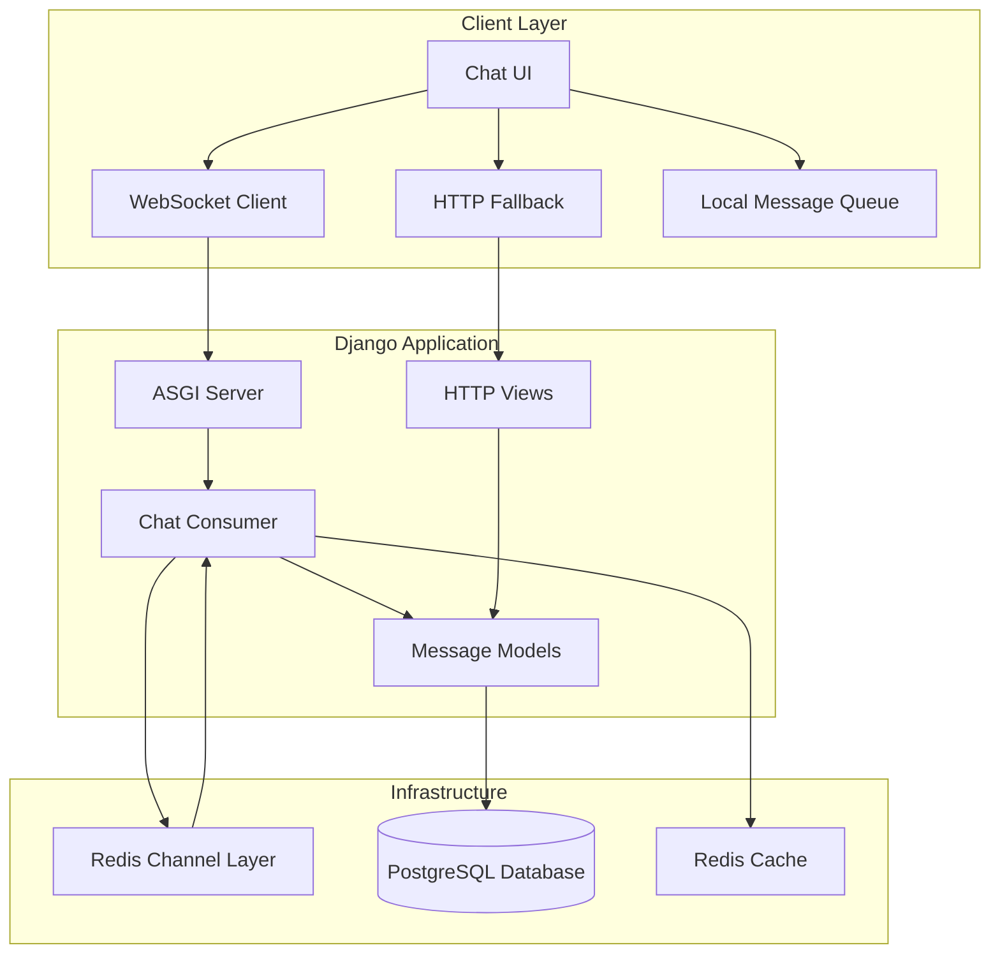
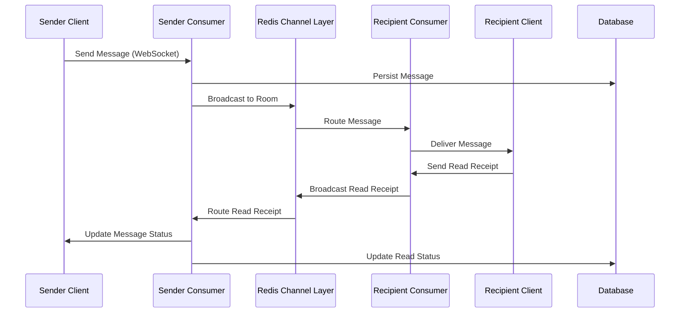
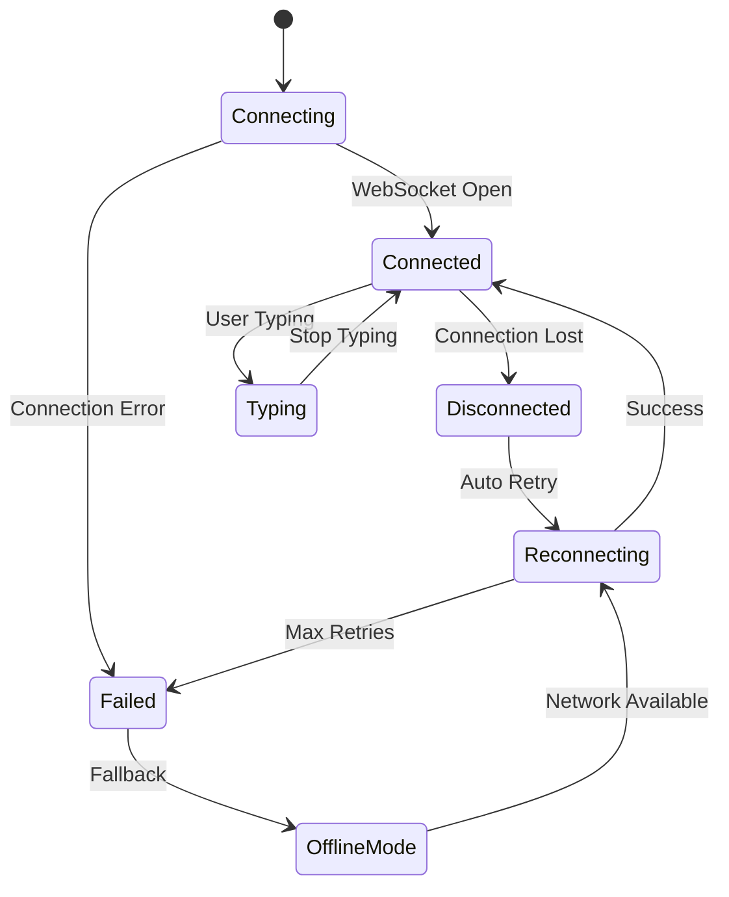

# Design Document

## Overview

This design addresses the critical issues in the Django real-time messaging system to achieve WhatsApp-like functionality. The solution focuses on fixing broken WebSocket infrastructure, implementing comprehensive message status tracking, robust offline handling, and seamless connection recovery.

The design leverages Django Channels with Redis for real-time communication, implements optimistic UI updates for responsiveness, and provides multiple fallback mechanisms to ensure message delivery reliability.

## Architecture

### High-Level Architecture



### Message Flow Architecture



### Connection Management Architecture



## Components and Interfaces

### 1. WebSocket Consumer (Fixed)

**Purpose**: Handle real-time WebSocket connections for chat and notifications

**Key Methods**:
- `connect()`: Establish WebSocket connection with authentication
- `disconnect()`: Clean up connection and update user status
- `receive()`: Process incoming messages (chat, typing, read receipts)
- `chat_message()`: Broadcast messages to room participants
- `typing_indicator()`: Handle typing status updates
- `user_status()`: Manage online/offline status

**Message Types Handled**:
- `message`: Regular chat messages
- `typing`: Typing indicator updates
- `read_receipt`: Message read confirmations
- `ping`: Connection health checks
- `retry`: Failed message retry attempts

### 2. Message Status Manager

**Purpose**: Track and update message delivery states (sent, delivered, read)

**Key Methods**:
- `mark_as_sent()`: Initial message creation
- `mark_as_delivered()`: Recipient device received message
- `mark_as_read()`: Recipient viewed message
- `get_status_icon()`: Generate appropriate checkmark display
- `broadcast_status_update()`: Notify sender of status changes

**Status States**:
- `sent`: Single gray checkmark
- `delivered`: Double gray checkmarks
- `read`: Double blue checkmarks
- `failed`: Red warning icon

### 3. Connection Recovery Manager

**Purpose**: Handle WebSocket reconnection with exponential backoff

**Key Methods**:
- `attempt_reconnect()`: Try to reestablish WebSocket connection
- `calculate_backoff()`: Exponential delay calculation
- `sync_missed_messages()`: Retrieve messages sent during disconnection
- `process_queued_messages()`: Send locally queued messages
- `update_connection_status()`: UI status indicator updates

**Reconnection Strategy**:
- Initial retry: 2 seconds
- Exponential backoff: 2s, 4s, 8s, 16s, 32s
- Maximum attempts: 5
- Fallback to offline mode after exhaustion

### 4. Offline Message Queue

**Purpose**: Store and manage messages when users are offline

**Key Methods**:
- `queue_outgoing_message()`: Store message for later delivery
- `queue_incoming_message()`: Store received messages for offline users
- `process_queue()`: Deliver queued messages when online
- `expire_old_messages()`: Clean up messages older than 7 days
- `get_queue_status()`: Return queue statistics

**Queue Types**:
- Outgoing queue: Messages waiting to be sent
- Incoming queue: Messages waiting for offline users
- Retry queue: Failed messages awaiting retry

### 5. Typing Indicator Manager

**Purpose**: Handle real-time typing status with debouncing

**Key Methods**:
- `start_typing()`: Begin typing indicator
- `stop_typing()`: End typing indicator
- `debounce_typing()`: Prevent excessive typing updates
- `broadcast_typing_status()`: Send typing state to participants
- `cleanup_stale_indicators()`: Remove abandoned typing states

**Debouncing Logic**:
- Send typing indicator immediately on first keystroke
- Debounce subsequent keystrokes for 200ms
- Auto-stop typing indicator after 1 second of inactivity

### 6. User Presence Manager

**Purpose**: Track and broadcast user online/offline status

**Key Methods**:
- `set_user_online()`: Mark user as online
- `set_user_offline()`: Mark user as offline with timestamp
- `get_user_status()`: Retrieve current user status
- `broadcast_status_change()`: Notify connected users of status changes
- `cleanup_stale_connections()`: Remove abandoned connections

**Status Tracking**:
- Online: Active WebSocket connection
- Offline: No active connections, show "last seen" timestamp
- Away: Connection idle for extended period

## Data Models

### Enhanced Message Model

```python
class Message(models.Model):
    sender = models.ForeignKey(User, related_name='sent_messages')
    recipient = models.ForeignKey(User, related_name='received_messages')
    content = models.TextField()
    
    # Status tracking
    is_read = models.BooleanField(default=False)
    read_at = models.DateTimeField(null=True, blank=True)
    delivered_at = models.DateTimeField(null=True, blank=True)
    created_at = models.DateTimeField(auto_now_add=True)
    
    # Retry and error handling
    retry_count = models.IntegerField(default=0)
    last_retry_at = models.DateTimeField(null=True, blank=True)
    error_message = models.TextField(blank=True)
    
    # Message identification
    client_id = models.CharField(max_length=100, blank=True)  # For deduplication
    
    class Meta:
        ordering = ['-created_at']
        indexes = [
            models.Index(fields=['recipient', 'created_at']),
            models.Index(fields=['sender', 'created_at']),
            models.Index(fields=['recipient', 'is_read']),
            models.Index(fields=['client_id']),
        ]
```

### Enhanced UserStatus Model

```python
class UserStatus(models.Model):
    user = models.OneToOneField(User, on_delete=models.CASCADE)
    is_online = models.BooleanField(default=False)
    last_seen = models.DateTimeField(auto_now=True)
    last_activity = models.DateTimeField(auto_now=True)
    
    # Connection tracking
    active_connections = models.IntegerField(default=0)
    last_ping = models.DateTimeField(null=True, blank=True)
    
    class Meta:
        indexes = [
            models.Index(fields=['is_online', 'last_seen']),
            models.Index(fields=['user', 'is_online']),
        ]
```

### Message Queue Model

```python
class QueuedMessage(models.Model):
    QUEUE_TYPES = [
        ('outgoing', 'Outgoing'),
        ('incoming', 'Incoming'),
        ('retry', 'Retry'),
    ]
    
    sender = models.ForeignKey(User, related_name='queued_sent_messages')
    recipient = models.ForeignKey(User, related_name='queued_received_messages')
    content = models.TextField()
    queue_type = models.CharField(max_length=20, choices=QUEUE_TYPES)
    
    # Queue management
    created_at = models.DateTimeField(auto_now_add=True)
    retry_count = models.IntegerField(default=0)
    max_retries = models.IntegerField(default=3)
    next_retry_at = models.DateTimeField(null=True, blank=True)
    is_processed = models.BooleanField(default=False)
    
    # Error tracking
    last_error = models.TextField(blank=True)
    
    class Meta:
        ordering = ['created_at']
        indexes = [
            models.Index(fields=['queue_type', 'is_processed']),
            models.Index(fields=['recipient', 'is_processed']),
            models.Index(fields=['next_retry_at']),
        ]
```

### Typing Status Model

```python
class TypingStatus(models.Model):
    user = models.ForeignKey(User, on_delete=models.CASCADE)
    chat_room = models.CharField(max_length=100)  # Room identifier
    is_typing = models.BooleanField(default=False)
    started_at = models.DateTimeField(auto_now_add=True)
    last_update = models.DateTimeField(auto_now=True)
    
    class Meta:
        unique_together = ('user', 'chat_room')
        indexes = [
            models.Index(fields=['chat_room', 'is_typing']),
            models.Index(fields=['last_update']),
        ]
```

## Correctness Properties

*A property is a characteristic or behavior that should hold true across all valid executions of a system-essentially, a formal statement about what the system should do. Properties serve as the bridge between human-readable specifications and machine-verifiable correctness guarantees.*

### Property 1: WebSocket Connection Establishment
*For any* valid user attempting to connect to chat or notifications, the WebSocket connection should establish successfully and route messages correctly through the channel layer
**Validates: Requirements 1.2, 1.3, 1.4**

### Property 2: Real-time Message Delivery
*For any* message sent between online users, the message should be delivered to the recipient's chat window within 100ms and persisted to the database immediately
**Validates: Requirements 2.1, 2.2, 2.3**

### Property 3: Message Broadcasting
*For any* chat room with multiple connected participants, messages should be broadcast to all participants simultaneously
**Validates: Requirements 2.4**

### Property 4: WebSocket Fallback Behavior
*For any* message that fails to send via WebSocket, the system should automatically attempt HTTP fallback delivery
**Validates: Requirements 2.5, 9.1**

### Property 5: Message Status Tracking
*For any* message sent through the system, the appropriate status indicator (sent, delivered, read, failed) should be displayed and updated in real-time as the message progresses through its lifecycle
**Validates: Requirements 3.1, 3.2, 3.3, 3.4, 3.5**

### Property 6: Typing Indicator System
*For any* user typing in a chat, typing indicators should be sent to other participants within 200ms, automatically stop after 1 second of inactivity, and be visible only to other participants
**Validates: Requirements 4.1, 4.2, 4.3, 4.4, 4.5**

### Property 7: User Presence Tracking
*For any* user connecting or disconnecting from the system, their online/offline status should be updated and broadcast to all connected users in real-time with appropriate visual indicators
**Validates: Requirements 5.1, 5.2, 5.3, 5.4, 5.5**

### Property 8: Connection Recovery System
*For any* WebSocket connection that is lost, the system should attempt automatic reconnection within 2 seconds using exponential backoff, synchronize missed messages upon reconnection, and queue outgoing messages during offline periods
**Validates: Requirements 6.1, 6.2, 6.3, 6.4, 6.5**

### Property 9: Offline Message Handling
*For any* message sent to an offline recipient, the message should be queued for delivery when they come online, delivered in chronological order, and expired after 7 days if undelivered
**Validates: Requirements 7.1, 7.2, 7.3, 7.4, 7.5**

### Property 10: Read Receipt System
*For any* message viewed by a recipient, a read receipt should be sent automatically to the sender, update the message status to "read" with timestamp, and handle bulk read receipts for multiple messages while preventing duplicate processing
**Validates: Requirements 8.1, 8.2, 8.3, 8.4, 8.5**

### Property 11: Message Retry System
*For any* message that fails to send, the system should attempt HTTP fallback, queue for retry with exponential backoff if that fails, limit retry attempts to 3 per message, and automatically process the retry queue when connectivity is restored
**Validates: Requirements 9.2, 9.3, 9.4, 9.5**

### Property 12: Optimistic UI Performance
*For any* message being sent or received, the UI should display optimistic updates within 50ms for sent messages and within 100ms for received messages
**Validates: Requirements 10.1, 10.2**

### Property 13: Chat History Pagination
*For any* chat history loading request, the system should implement infinite scroll with progressive loading of exactly 20 messages per batch
**Validates: Requirements 10.3**

### Property 14: Typing Indicator Optimization
*For any* scenario with multiple users typing simultaneously, the system should efficiently batch and debounce typing indicators to prevent excessive network traffic
**Validates: Requirements 10.4**

### Property 15: Connection Heartbeat
*For any* active WebSocket connection, the system should maintain the connection with periodic heartbeat pings every 30 seconds
**Validates: Requirements 10.5**

### Property 16: Message Persistence and Synchronization
*For any* message sent or received, the system should persist it to the database with accurate timestamps and synchronize status changes across all connected clients and browser tabs
**Validates: Requirements 11.1, 11.3, 11.4**

### Property 17: Chat Loading Behavior
*For any* user opening a chat, the system should load the most recent 50 messages with pagination support
**Validates: Requirements 11.2**

### Property 18: Concurrent Operation Safety
*For any* concurrent message operations, the system should handle them with proper database locking to prevent race conditions and maintain data consistency
**Validates: Requirements 11.5**

### Property 19: Comprehensive Error Handling
*For any* system error (connection failures, delivery failures, server unreachability, database failures), the system should display clear error messages, provide fallback options or retry mechanisms, and implement circuit breaker patterns during high load
**Validates: Requirements 12.1, 12.2, 12.3, 12.4, 12.5**

## Error Handling

### WebSocket Error Handling

**Connection Errors**:
- Invalid authentication: Close connection with 4001 code
- Rate limiting: Close connection with 4029 code  
- Server overload: Close connection with 4503 code
- Invalid message format: Send error response, maintain connection

**Message Processing Errors**:
- Database failures: Log error, send failure response to client
- Validation errors: Send validation error response
- Permission errors: Send permission denied response
- Timeout errors: Implement circuit breaker pattern

### HTTP Fallback Error Handling

**Request Errors**:
- Invalid CSRF token: Return 403 with clear error message
- Rate limiting: Return 429 with retry-after header
- Validation errors: Return 400 with field-specific errors
- Authentication errors: Return 401 with redirect to login

**Server Errors**:
- Database connection failures: Return 503 with retry guidance
- Timeout errors: Return 504 with fallback suggestions
- Internal errors: Return 500 with generic error message, log details

### Client-Side Error Handling

**Network Errors**:
- Connection timeout: Display "Connection timeout" with retry button
- Network unavailable: Switch to offline mode, queue messages
- Server unreachable: Display "Server unavailable" with status updates

**Application Errors**:
- Message send failures: Show red warning icon with retry option
- Invalid input: Display inline validation errors
- Permission denied: Show clear permission error message

## Testing Strategy

### Dual Testing Approach

The testing strategy employs both unit tests and property-based tests to ensure comprehensive coverage:

**Unit Tests**: Focus on specific examples, edge cases, and integration points
- WebSocket connection establishment with various user states
- Message status transitions for specific scenarios
- Error handling for known failure modes
- UI component behavior with mock data
- Database operations with specific test data

**Property-Based Tests**: Verify universal properties across all inputs
- Message delivery properties with randomly generated users and content
- Connection recovery behavior with simulated network conditions
- Status tracking properties with various message states
- Typing indicator behavior with random timing patterns
- Offline queue management with various queue states

### Property-Based Testing Configuration

**Testing Framework**: Use Hypothesis for Python property-based testing
**Test Configuration**: Minimum 100 iterations per property test
**Test Tagging**: Each property test references its design document property

**Example Property Test Structure**:
```python
@given(
    sender=users_strategy(),
    recipient=users_strategy(),
    message_content=text_strategy()
)
@settings(max_examples=100)
def test_message_delivery_property(sender, recipient, message_content):
    """
    Feature: whatsapp-messaging-fix, Property 2: Real-time Message Delivery
    For any message sent between online users, the message should be delivered 
    to the recipient's chat window within 100ms and persisted to the database immediately
    """
    # Test implementation
    pass
```

### Integration Testing

**WebSocket Integration Tests**:
- End-to-end message flow from sender to recipient
- Connection recovery scenarios with simulated network failures
- Multi-user chat scenarios with concurrent operations
- Real-time status updates across multiple connections

**Database Integration Tests**:
- Message persistence under concurrent load
- Queue management with various failure scenarios
- Status tracking consistency across operations
- Data migration and schema validation

### Performance Testing

**Load Testing**:
- Concurrent WebSocket connections (target: 1000+ simultaneous)
- Message throughput testing (target: 100+ messages/second)
- Memory usage under sustained load
- Database query performance optimization

**Latency Testing**:
- Message delivery timing verification
- Typing indicator response time measurement
- Status update propagation timing
- Connection establishment time measurement

### Error Scenario Testing

**Network Failure Simulation**:
- WebSocket connection drops during message sending
- Intermittent connectivity with message queuing
- Server restart scenarios with connection recovery
- Redis channel layer failures with fallback behavior

**Database Failure Testing**:
- Database connection timeouts during message persistence
- Concurrent write conflicts with proper locking
- Transaction rollback scenarios
- Data consistency verification after failures